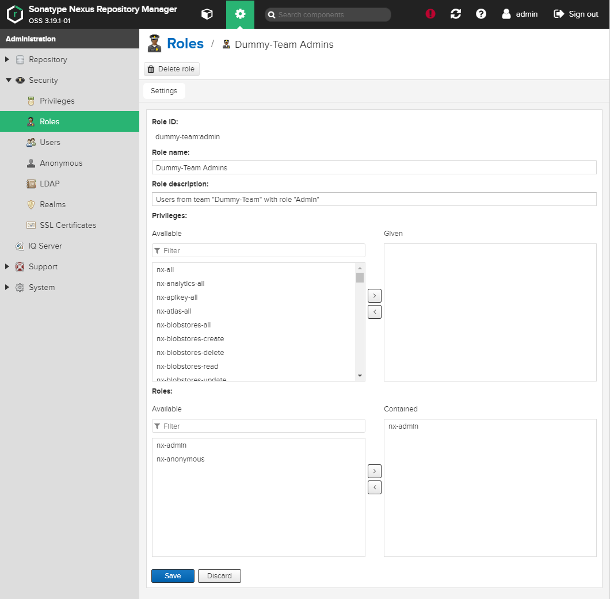

# Nexus3 Bitbucket Cloud Auth Plugin

This plugin adds a Bitbucket Cloud Authentication Realm to Sonatype Nexus OSS and enables you to authenticate with Bitbucket Users and authorize with Bitbucket Teams/Roles.

The plugin does not implement a full OAuth flow, instead you use your Bitbucket `Username` + `Password`. You may also use an `App Password` that has at lease `Account_Read` and Team `Membership_Read` permissions.
This works through the web as well as through tools like maven, gradle etc.

## Setup

### 1. Activate the Realm

Log in to your nexus and go to _Administration > Security > Realms_. Move the **Bitbucket Cloud Authentication Realm** to the right. The realm order in the form determines the order of the realms in your authentication flow. We recommend putting Bitbucket _after_ the built-in realms:


### 2. Group / Roles Mapping

When logged in through Bitbucket, all teams the user is a member of will be mapped into roles like so:

_team_name:role_ e.g. `dummy-team:admin`

You need to manually create these roles in _Administration > Security > Roles > (+) Create Role > Nexus Role_ in order to assign them the desired priviliges. The _Role ID_ should map to the _team_name:role_. Note that by default anybody is allowed to login (authenticate) with a valid Bitbucket account, but he/she won't have any priviledges assigned with their teams (authorization).



## Installation

### 0. Prerequisites

#### Directory naming convention:

For the following commands we assume your nexus installation resides in `/opt/sonatype/nexus`.

See [https://help.sonatype.com/repomanager3/installation/directories](https://help.sonatype.com/repomanager3/installation/directories) for reference.

### 1. Download and install

The following lines will:

- create a directory in the `nexus` / `kafka` maven repository
- download the latest release from github
- unzip the release to the maven repository
- add the plugin to the `karaf` `startup.properties`.

```shell
mkdir -p /opt/sonatype/nexus/system/it/marcoreni/ &&\
wget -O /opt/sonatype/nexus/system/it/marcoreni/nexus3-bitbucketcloud-auth-plugin.zip https://github.com/marcoreni/nexus3-bitbucketcloud-auth-plugin/releases/download/1.0.1/nexus3-bitbucketcloud-auth-plugin.zip &&\
unzip /opt/sonatype/nexus/system/it/marcoreni/nexus3-bitbucketcloud-auth-plugin.zip -d /opt/sonatype/nexus/system/it/marcoreni/ &&\
echo "mvn\:it.marcoreni/nexus3-Bitbucketcloud-auth-plugin/1.0.1 = 200" >> /opt/sonatype/nexus/etc/karaf/startup.properties
```

### 2. Restart Nexus

Restart your Nexus instance to let it pick up your changes.

## Development

You can build the project with the integrated maven wrapper like so:

```shell
./mvnw clean package
```

or can also build locally using Docker by running:

```shell
docker run --rm -it -v $(pwd):/data -w /data maven:3.5.2 mvn clean package
```

## Testing

You can build a ready to run docker image using the [`Dockerfile`](Dockerfile) to quickly spin up a nexus with the plugin already preinstalled:

```shell
docker build -t rti-sonatype-nexus:3.19.1-bitbucketcloud-auth-plugin .

docker run --rm -it -p 8081:8081 rti-sonatype-nexus:3.19.1-bitbucketcloud-auth-plugin
```

To get the admin password use:

```shell
docker exec -it <container-id> cat /nexus-data/admin.password
```

## Credits

The whole project is heavily influenced by the [nexus3-crowd-plugin](https://github.com/pingunaut/nexus3-crowd-plugin).
